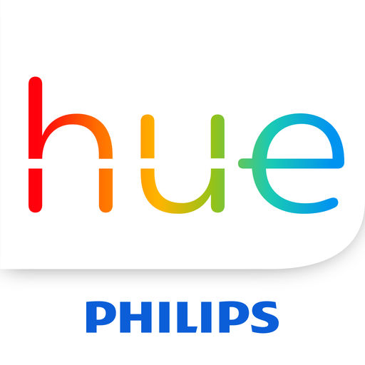

<!-- ---
layout: post
title: Philips Hue
description: Apps for Philips hue smart lights
image: assets/images/hue_kit.jpeg
nav-menu: true
show_tile: false
--- -->

If you are familiar with Smart lights at all, you must have heard about Philips Hue. Hue lights are very popular, aesthetically pleasing and feature rich smart lights present in market. One of the best thing about Philips hue is their apps ecosystem. There are literally hundreds of apps present in market, each offering you a new way to enjoy your Philips Hue lights. Here are few of the popular apps for Hue:

<section id="two" class="spotlights">
	<section>
		
		

			

				<header class="major">
					<h3>Official Hue App</h3>
				</header>
				
This is the official Hue app from Philips. You need to have this app for introduction to system, software updates and exploring Hue world.

				<ul class="actions">
					<li><a href="https://www2.meethue.com/en-in/philips-hue-app" class="button">Website</a></li>
				</ul>
			

		

	</section>
	<section>
		
		

			

				<header class="major">
					<h3>HueHello</h3>
				</header>
				
It is another app for Hue lights we recommend. This app is really mature in terms of features and user-experience. From simple on-off to fancy features, HueHello has it all. They also offer Plugins for various use-cases and help you utilize your money well.

				<ul class="actions">
					<li><a href="https://huehello.com/apps/huehello/" class="button">Website</a></li>
				</ul>
			

		

	</section>
</section>
