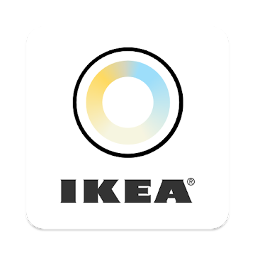

Smart lighting at IKEA is an expandable system you can add on to as your lighting needs change. Ikea range offers wireless LED bulbs, panels, and doors for furniture. If you are looking for an entry level and budget smart lights , it is a good option to consider. 

Here are few of the popular apps for Ikea:

<section id="two" class="spotlights">
	<section>
		
		

			

				<header class="major">
					<h3>Official Ikea App</h3>
				</header>
				
This is the official app from Ikea. You need to have this app for introduction to system, software updates and exploring Ikea world.

				<ul class="actions">
					<li><a href="https://play.google.com/store/apps/details?id=com.ikea.tradfri.lighting&hl=en" class="button">Android App</a></li>
					<li><a href="https://itunes.apple.com/us/app/ikea-tr%C3%A5dfri/id1195836071?mt=8" class="button">iPhone App</a></li>
				</ul>
			

		

	</section>
</section>
